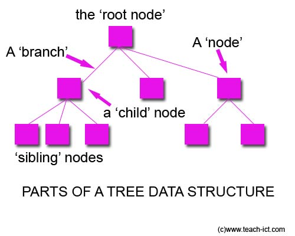

#### Trees

Tree data structures provide a way to structure and organize data via hierarchy with parent-child relationships.  While nodes in LinkedLists are linked linearly, nodes in Trees are not.

Each tree has a root node with zero or more children nodes.  Each node is essentially a subtree.

We usually define a Tree itself as a class, with an array containing any number of subtrees.

The basic operations of a tree are:

* `.addNode(...)` function that adds child nodes to the current node (or one specified as a parameter, if applicable)
* `.removeNode(...)` removes a node from the current node (or one specified as a parameter, if applicable)
* `findNode(...)` searches the tree and returns which ever node(s) contain the specied value
* `.children[]` property.  An array or other container that contains the subtrees